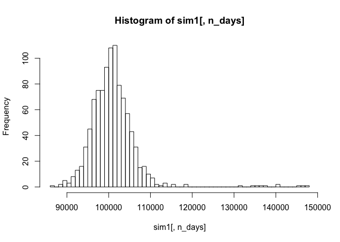
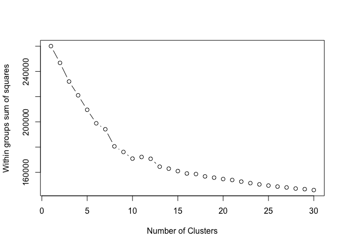

1. Probability Practice
-----------------------

### Part A

According to the conditions given by the questin, we know that:
$$
\\begin{align}
&P(RC) = 0.30\\\\
&P(TC) = 0.70\\\\
&P(Yes|RC) = 0.50\\\\
&P(Yes) = 0.65\\\\
\\end{align}
$$
 Also, according to the Law of total probability, we know:
$$
\\begin{align}
P(Yes) &= P(Yes|RC) \\cdot P(RC) + P(Yes|TC) \\cdot P(TC)\\\\
0.65 &= 0.50 \\times 0.30 + P(Yes|TC) \\times 0.7
\\end{align}
$$

$$
\\begin{align}
P(Yes|TC) &= \\frac{0.65 - 0.50 \\times 0.30}{0.7}\\\\
&= \\frac{5}{7} \\approx 0.71
\\end{align}
$$

### Part B

From the conditions given by the problem, we know that:
$$
\\begin{align}
&P(Disease) = 0.000025\\\\
&P(No Disease) = 0.999975\\\\
&P(Positive|Disease) = 0.993\\\\
&P(Negative|No Disease) = 0.9999\\\\
&P(Positive|No Disease) = 0.0001
\\end{align}
$$
 According to the Law of total probability, we know:
$$
\\begin{align}
P(Postive) &= P(Positive|Disease) \\cdot P(Disease) + P(Positive|No Disease) \\cdot P(No Disease)\\\\
&= 0.993 \\times 0.000025 + 0.0001 \\times 0.999975\\\\
&= 0.00010248225
\\end{align}
$$

Next, based on the Bayes’ rule, we can find the P(Disease|Positive) in
following:
$$
\\begin{align}
P(Disease|Postive) &= \\frac{P(Positive|Disease) \\cdot P(Disease)}{P(Positive)}\\\\ 
&= \\frac{0.993 \\times 0.000025}{0.00010248225}\\\\
&\\approx 0.1989 
\\end{align}
$$

The probability that they have the disease if they test positive is
approximately 19.89%. We believe implementing this universal testing
policy may cause panic and unease to those who do not have the disease
in fact, given that the incidence of the disease is reasonably rare,
which is only about 0.0025%.

2. Exploratory analysis: green buildings
----------------------------------------

The so-called “total excel guru” has completely wrong in his theory. If
the developed chooses to listen to his recommendation and takes actions,
the consequences can be disaterous.

Firstly, guru proposed to use sample median to estimate the true mean.
Indeed, from what he has seen, median is less sensitive to outliers.
However, using sample median to estimate the true mean is biased and the
standard deviation can be unacceptable large. Therefore, we couldn’t use
a biased estimator(median) to estimate the true mean(which is rent
here). Instead, we should use sample mean to estimate the true mean
since sample mean is the unbiased estimator of true mean.

Secondly, guru only saw the potential rents between green houses and
non-green houses. He did not take the utility costs such as gas and
electricity costs into consideration. For green houses, utility costs
are less than that of non-green houses normally. If we ignore the fact
that green houses cost less on utility fee, we might underestimate the
potential profits of green houses as with non-green houses.

Above, I suggest we use the sample mean to estimate the true mean while
at the same time taking utility costs into consideration. I primarily
use Bootstrap method to estimate the true rents and true utility
costs(gas and electricity costs) for 4 different types of houses:

1.  green houses which do not cover utility fee(i.e. green\_rating == 1
    & net == 1),

2.  green houses which cover utility fee(i.e. green\_rating == 1 & net
    == 0),

3.  non-green houses which do not cover utility fee(i.e. green\_rating
    == 0 & net == 1),

4.  non-green houses which cover utility fee(i.e. green\_rating == 0 &
    net == 0)

<!-- -->

    library(mosaic)
    green = read.csv("greenbuildings.csv")

### Extract the buildings whether they are green ratings or not and whether they include utility costs or not

    green_isnet = subset(green, green_rating == 1 & net == 1)     # dim:39 23
    dim(green_isnet)
    green_notnet = subset(green, green_rating == 1 & net == 0)    # dim:646 23
    dim(green_notnet)
    notgreen_isnet = subset(green, green_rating == 0 & net == 1)  # dim:235 23
    dim(notgreen_isnet)
    notgreen_notnet = subset(green, green_rating == 0 & net == 0) # dim:6974 23
    dim(notgreen_notnet)

### Bootstrap to estimate the true value of rents in each buidlings

    set.seed(999)

    green_isnet_boot = do(5000)*{    # Boostrap to estimate the rent of green buildings which do not include utilities
      mean(resample(green_isnet)$Rent)
    }
    green_notnet_boot = do(5000)*{   # Boostrap to estimate the rent of green buildings which include utilities
      mean(resample(green_notnet)$Rent)
    }
    notgreen_isnet_boot = do(5000)*{ # Boostrap to estimate the rent of non-green buildings which do not include utilities
      mean(resample(notgreen_isnet)$Rent)
    }
    notgreen_notnet_boot = do(5000)*{# Boostrap to estimate the rent of non-green buildings which include utilities
      mean(resample(notgreen_notnet)$Rent)
    }

The rent of green buildings which do not include utilities is 24.402
with standard error 1.262

The rent of green buildings which include utilities is 30.353 with
standard error 0.52

The rent of non-green buildings which do not include utilities is 24.394
with standard error 0.767

The rent of nongreen buildings which include utilities is 28.397 with
standard error 0.183

### Visualization

    par(mfrow = c(2, 2))

    hist(green_isnet_boot$result, 50, xlab = 'Rent for green net buidlings', main = 'Histogram of green net buidlings rents')
    sd_gn = sd(green_isnet_boot$result)
    mean_gn = mean(green_isnet_boot$result)
    abline(v = mean(green_isnet_boot$result), col = 'red', lwd = 5)
    text(26, 300, labels = paste('Mean:', as.character(round(mean_gn, 3)), 'SD:', as.character(round(sd_gn, 3))), col = 'black', cex = 1.1, font = 2)

    hist(green_notnet_boot$result, 50, xlab = 'Rent for green non-net buidlings', main = 'Histogram of green non-net buidlings rents')
    sd_gnn = sd(green_notnet_boot$result)
    mean_gnn = mean(green_notnet_boot$result)
    abline(v = mean(green_notnet_boot$result), col = 'red', lwd = 5)
    text(31, 330, labels = paste('Mean:', as.character(round(mean_gnn, 3)), 'SD:', as.character(round(sd_gnn, 3))), col = 'black', cex = 1.1, font = 2)

    hist(notgreen_isnet_boot$result, 50, xlab = 'Rent for non-green net buidlings', main = 'Histogram of non-green net buidlings rents')
    sd_ngn = sd(notgreen_isnet_boot$result)
    mean_ngn = mean(notgreen_isnet_boot$result)
    abline(v = mean(notgreen_isnet_boot$result), col = 'red', lwd = 5)
    text(25, 250, labels = paste('Mean:', as.character(round(mean_ngn, 3)), 'SD:', as.character(round(sd_ngn, 3))), col = 'black', cex = 1.1, font = 2)

    hist(notgreen_notnet_boot$result, 50, xlab = 'Rent for non-green non-net buidlings', main = 'Histogram of non-green non-net buidlings rents')
    sd_ngnn = sd(notgreen_notnet_boot$result)
    mean_ngnn = mean(notgreen_notnet_boot$result)
    abline(v = mean(notgreen_notnet_boot$result), col = 'red', lwd = 5)
    text(28.6, 180, labels = paste('Mean:', as.character(round(mean_ngnn, 3)), 'SD:', as.character(round(sd_ngnn, 3))), col = 'black', cex = 1.1, font = 2)

### Bootstrap to estimate the true value of gas costs

    set.seed(9999)

    green_isnet_gas_boot = do(5000)*{     # Boostrap to estimate the gas costs of green buildings which do not include utilities
      mean(resample(green_isnet)$Gas_Costs)
    }
    green_notnet_gas_boot = do(5000)*{    # Boostrap to estimate the gas costs of green buildings which include utilities
      mean(resample(green_notnet)$Gas_Costs)
    }
    notgreen_isnet_gas_boot = do(5000)*{  # Boostrap to estimate the gas costs of non-green building which do not include utilities
      mean(resample(notgreen_isnet)$Gas_Costs)
    }
    notgreen_notnet_gas_boot = do(5000)*{ # Boostrap to estimate the gas costs of non-green building which include utilities
      mean(resample(notgreen_notnet)$Gas_Costs)
    }

The gas cost of green buildings which do not include utilities is
0.01135 with standard error 0.00051

The gas cost of green buildings which include utilities is 0.01108 with
standard error 7e-05

The gas cost of non-green buildings which do not include utilities is
0.01299 with standard error 0.0003

The gas cost of nongreen buildings which include utilities is 0.0113
with standard error 3e-05

### Visualization

    par(mfrow = c(2, 2))

    hist(green_isnet_gas_boot$result, 50, xlab = 'Gas cost for green net buidlings', main = 'Histogram of green net buidlings gas cost')
    sd_gn_gas = sd(green_isnet_gas_boot$result)
    mean_gn_gas = mean(green_isnet_gas_boot$result)
    abline(v = mean(green_isnet_gas_boot$result), col = 'red', lwd = 5)
    text(0.0125, 150, labels = paste('Mean:', as.character(round(mean_gn_gas, 5)), 'SD:', as.character(round(sd_gn_gas, 5))), col = 'black', cex = 1.1, font = 2)

    hist(green_notnet_gas_boot$result, 50, xlab = 'Gas cost for green non-net buidlings', main = 'Histogram of green non-net buidlings gas cost')
    sd_gnn_gas = sd(green_notnet_gas_boot$result)
    mean_gnn_gas = mean(green_notnet_gas_boot$result)
    abline(v = mean(green_notnet_gas_boot$result), col = 'red', lwd = 5)
    text(0.0112, 200, labels = paste('Mean:', as.character(round(mean_gnn_gas, 5)), 'SD:', as.character(round(sd_gnn_gas, 5))), col = 'black', cex = 1.1, font = 2)

    hist(notgreen_isnet_gas_boot$result, 50, xlab = 'Gas cost for non-green net buidlings', main = 'Histogram of non-green net buidlings gas cost')
    sd_ngn_gas = sd(notgreen_isnet_gas_boot$result)
    mean_ngn_gas = mean(notgreen_isnet_gas_boot$result)
    abline(v = mean(notgreen_isnet_gas_boot$result), col = 'red', lwd = 5)
    text(0.0135, 200, labels = paste('Mean:', as.character(round(mean_ngn_gas, 5)), 'SD:', as.character(round(sd_ngn_gas, 5))), col = 'black', cex = 1.1, font = 2)

    hist(notgreen_notnet_gas_boot$result, 50, xlab = 'Gas cost for non-green non-net buidlings', main = 'Histogram of non-green non-net buidlings gas cost')
    sd_ngnn_gas = sd(notgreen_notnet_gas_boot$result)
    mean_ngnn_gas = mean(notgreen_notnet_gas_boot$result)
    abline(v = mean(notgreen_notnet_gas_boot$result), col = 'red', lwd = 5)
    text(0.0113, 300, labels = paste('Mean:', as.character(round(mean_ngnn_gas, 5)), 'SD:', as.character(round(sd_ngnn_gas, 5))), col = 'black', cex = 1.1, font = 2)

### Bootstrap to estimate the true value of electricity costs

    set.seed(99999)

    green_isnet_electricity_boot = do(5000)*{   # Boostrap to estimate  electricity costs of green buildings which do not include utilities
      mean(resample(green_isnet)$Electricity_Costs)
    }
    green_notnet_electricity_boot = do(5000)*{  # Boostrap to estimate electricity costs of green buildings which include utilities
      mean(resample(green_notnet)$Electricity_Costs)
    }
    notgreen_isnet_electricity_boot = do(5000)*{# Boostrap to estimate electricity costs of non-green building do not include utilities
      mean(resample(notgreen_isnet)$Electricity_Costs)
    }
    notgreen_notnet_electricity_boot = do(5000)*{ # Boostrap to estimate  electricity costs of non-green building which include utilities
      mean(resample(notgreen_notnet)$Electricity_Costs)
    }

### Visualization

    par(mfrow = c(2, 2))

    hist(green_isnet_electricity_boot$result, 50, xlab = 'Electricity cost for green net buidlings', main = 'Histogram of green net buidlings electricity cost')
    sd_gn_electricity = sd(green_isnet_electricity_boot$result)
    mean_gn_electricity = mean(green_isnet_electricity_boot$result)
    abline(v = mean(green_isnet_electricity_boot$result), col = 'red', lwd = 5)
    text(0.03, 300, labels = paste('Mean:', as.character(round(mean_gn_electricity, 5)), 'SD:', as.character(round(sd_gn_electricity, 5))), col = 'black', cex = 1.1, font = 2)

    hist(green_notnet_electricity_boot$result, 50, xlab = 'Electricity cost for green non-net buidlings', main = 'Histogram of green non-net buidlings electricity cost')
    sd_gnn_electricity = sd(green_notnet_electricity_boot$result)
    mean_gnn_electricity = mean(green_notnet_electricity_boot$result)
    abline(v = mean(green_notnet_electricity_boot$result), col = 'red', lwd = 5)
    text(0.032, 250, labels = paste('Mean:', as.character(round(mean_gnn_electricity, 5)), 'SD:', as.character(round(sd_gnn_electricity, 5))), col = 'black', cex = 1.1, font = 2)

    hist(notgreen_isnet_electricity_boot$result, 50, xlab = 'Electricity cost for non-green net buidlings', main = 'Histogram of non-green net buidlings electricity cost')
    sd_ngn_electricity = sd(notgreen_isnet_electricity_boot$result)
    mean_ngn_electricity = mean(notgreen_isnet_electricity_boot$result)
    abline(v = mean(notgreen_isnet_electricity_boot$result), col = 'red', lwd = 5)
    text(0.034, 200, labels = paste('Mean:', as.character(round(mean_ngn_electricity, 5)), 'SD:', as.character(round(sd_ngn_electricity, 5))), col = 'black', cex = 1.1, font = 2)

    hist(notgreen_notnet_electricity_boot$result, 50, xlab = 'Electricity cost for non-green non-net buidlings', main = 'Histogram of non-green non-net buidlings electricity cost')
    sd_ngnn_electricity = sd(notgreen_notnet_electricity_boot$result)
    mean_ngnn_electricity = mean(notgreen_notnet_electricity_boot$result)
    abline(v = mean(notgreen_notnet_electricity_boot$result), col = 'red', lwd = 5)
    text(0.0308, 300, labels = paste('Mean:', as.character(round(mean_ngnn_electricity, 5)), 'SD:', as.character(round(sd_ngnn_electricity, 5))), col = 'black', cex = 1.1, font = 2)

The electricity cost of green buildings which do not include utilities
is 0.02902 with standard error 0.00124

The electricity cost of green buildings which include utilities is
0.03173 with standard error 0.00031

The electricity cost of non-green buildings which do not include
utilities is 0.03333 with standard error 0.00079

The electricity cost of nongreen buildings which include utilities is
0.03082 with standard error 1e-04

### Results Comparison

    greenYes = c(round(mean_gn, 5), round(mean_gnn, 5))
    greenNo = c(round(mean_ngn, 5), round(mean_ngnn, 5))
    Rent = c('Utility not included', 'Utility included')
    rent_df = data.frame(cbind(Rent, greenYes, greenNo))

    greenYes = c(round(mean_gn_gas, 5), round(mean_gnn_gas, 5))
    greenNo = c(round(mean_ngn_gas, 5), round(mean_ngnn_gas, 5))
    Gas_Cost = c('Utility not included', 'Utility included')
    gas_df = data.frame(cbind(Gas_Cost, greenYes, greenNo))

    greenYes = c(round(mean_gn_electricity, 5), round(mean_gnn_electricity, 5))
    greenNo = c(round(mean_ngn_electricity, 5), round(mean_ngnn_electricity, 5))
    Electricity_Cost = c('Utility not included', 'Utility included')
    electricity_df = data.frame(cbind(Electricity_Cost, greenYes, greenNo))

### Conclusion:

Here, we create a pivot table of 4 different types of houses:

    rent_df

    ##                   Rent greenYes  greenNo
    ## 1 Utility not included 24.40164 24.39386
    ## 2     Utility included  30.3531 28.39656

    gas_df

    ##               Gas_Cost greenYes greenNo
    ## 1 Utility not included  0.01135 0.01299
    ## 2     Utility included  0.01108  0.0113

    electricity_df

    ##       Electricity_Cost greenYes greenNo
    ## 1 Utility not included  0.02902 0.03333
    ## 2     Utility included  0.03173 0.03082

If we choose to build green building but we don’t want to cover utility,
market rent in the non-green buildings was 24.39386 per square foot per
year, while the market rent in the green buildings was 24.40164 per
square foot per year: about 0.00778 more per square foot. Because our
building would be 250,000 square feet, this would translate into an
additional 250,000 x 0.00778 = 1945 of extra revenue per year if we
build the green building. 5,000,000/1945 = 2570.69 years to recuperate.
Sounds crazy!!

If we choose to build green building and we want to cover utility,
market rent in the non-green buildings was 28.39656 per square foot per
year, while the market rent in the green buildings was 30.3531 per
square foot per year. We should also take utility costs into
consideration. The profit for green buildings will be 30.3531 - 0.01108
- 0.03173 = 30.31029 while the profit for non-green buildings will be
28.39656 - 0.0113 - 0.03082 = 28.35444. Because our building would be
250,000 square feet, this would translate into an additional 250,000 x
(30.31029 - 28.35444) = 488,962.5 of extra revenue per year if we build
the green building. 5,000,000/488,962.5 = 10.226 years to recuperate. So
after 10 years, we would be making money at about $488692.5 per year.

#### Choosing to build green buildings is your decision, but I am telling you that if you are going to build green buildings, you must cover the utility fee and it takes 10 years to recuperate. If you don’t want to cover the utility costs of your green house, you would have to wait 2570 years to recuperate. Good Luck!

3. Bootstrapping
----------------

### Portfolio 1: Even Split for Five ETFs

    library(mosaic)
    library(quantmod)
    library(foreach)

    # Import five ETFs
    mystocks = c("SPY", "TLT", "LQD", "EEM", "VNQ")
    getSymbols(mystocks)

    ## [1] "SPY" "TLT" "LQD" "EEM" "VNQ"

    #Adjusting each ETF 
    for(ticker in mystocks) {
      expr = paste0(ticker, "a = adjustOHLC(", ticker, ")")
      eval(parse(text=expr))
    }
    #Initial conditions
    initial_wealth = 100000
    n_days = 20
    set.seed(2)
    # Combine all the returns in a matrix
    all_returns_5 = cbind(ClCl(SPYa),
                        ClCl(TLTa),
                        ClCl(LQDa),
                        ClCl(EEMa),
                        ClCl(VNQa))
    all_returns_5 = as.matrix(na.omit(all_returns_5))
    #Bootrapping this portfolio with 20 days for 1000 times  
    holding_mat_5 = matrix(0, 1000, 5)
    sim1 = foreach(i=1:1000, .combine='rbind') %do% {
      total_wealth = initial_wealth
      weights = c(0.2, 0.2, 0.2, 0.2, 0.2)
      holdings = weights * total_wealth
      wealthtracker = rep(0, n_days)
      for(today in 1:n_days) {
        return.today = resample(all_returns_5, 1, orig.ids=FALSE)
        holdings = holdings + holdings*return.today
        total_wealth = sum(holdings)
        wealthtracker[today] = total_wealth
      }
      holding_mat_5[i,] = holdings
      wealthtracker
    }
    #Display the 1000 results
    hist(sim1[,n_days], breaks = 50)

    # Profit/loss
    mean(sim1[,n_days]) - initial_wealth

    ## [1] 973.3381

    hist(sim1[,n_days]- initial_wealth, breaks=30)

    # Calculate 5% value at risk
    quantile(sim1[,n_days], 0.05) - initial_wealth

    ##       5% 
    ## -5909.42

    #Calculate mean of return for each assets
    Mean_return = rep(0, 5)
    for(i in 1:5){
      Mean_return[i] = mean(holding_mat_5[,i])- initial_wealth*0.2
    }
    Mean_return

    ## [1] 118.43971 158.94460  78.10525 437.18152 180.66702

    # Calculate 5% value at risk for each assets
    for(j in 1:5){
    print(quantile(holding_mat_5[,j], 0.05) - initial_wealth*0.2)
    }

    ##        5% 
    ## -1650.782 
    ##        5% 
    ## -1219.402 
    ##        5% 
    ## -598.1995 
    ##        5% 
    ## -2627.183 
    ##        5% 
    ## -2823.134

We started with evenly split: separate our asset into five ETFs,
randomly select 20 days for 1000 times and get the final returns and 5%
Value at Risk of our first portfolio and each ETF. The return and VaR
show that SPY, TLT and LQD are of low return and low risk. EEM and VNQ
are of the relatively high return and high risk. The combined mean
return for even split portfolio in 4 weeks was $973.34 and 5% VaR is
-$5909.42.

### Portfolio 2: SPY, TLT & LQD (Safe One)

    set.seed(2)
    all_returns_3 = cbind(ClCl(SPYa),
                         ClCl(TLTa),
                         ClCl(LQDa))
    all_returns_3 = as.matrix(na.omit(all_returns_3))
    #Bootrapping this portfolio with 20 days for 1000 times  
    sim2 = foreach(i=1:1000, .combine='rbind') %do% {
      total_wealth = initial_wealth
      weights = c(0.3, 0.4, 0.3)
      holdings = weights * total_wealth
      wealthtracker = rep(0, n_days)
      for(today in 1:n_days) {
        return.today = resample(all_returns_3, 1, orig.ids=FALSE)
        holdings = holdings + holdings*return.today
        total_wealth = sum(holdings)
        wealthtracker[today] = total_wealth
      }
      wealthtracker
    }
    #Display the 1000 results
    hist(sim2[,n_days], breaks = 50)

    # Profit/loss
    mean(sim2[,n_days]) - initial_wealth

    ## [1] 612.7066

    hist(sim2[,n_days] - initial_wealth, breaks=30)

    # Calculate 5% value at risk
    quantile(sim2[,n_days], 0.05) - initial_wealth

    ##        5% 
    ## -2946.177

Then we selected SPY, TLT and LQD to form our safer portfolio with the
allocation of 30%, 40% and 30%. After bootstrap resampling for 1000
times, the mean return of our safer portfolio in 4 weeks was $612.71 and
5% Value at Risk is -$2946.18, which is safer and less rewarding than
the even split portfolio.

### Portfolio 3: LQD & EEM (Aggresive One)

    set.seed(2)
    all_returns_2 = cbind(ClCl(EEMa),
                          ClCl(VNQa))
    all_returns_2 = as.matrix(na.omit(all_returns_2))
    #Bootrapping this portfolio with 20 days for 1000 times
    #In addition, we rebalanced the portfolio each day
    sim3 = foreach(i=1:1000, .combine='rbind') %do% {
      total_wealth = initial_wealth
      weights = c(0.9, 0.1)
      holdings = weights * total_wealth
      wealthtracker = rep(0, n_days)
      for(today in 1:n_days) {
        return.today = resample(all_returns_2, 1, orig.ids=FALSE)
        holdings = holdings + holdings*return.today
        total_wealth = sum(holdings)
        holdings = c(total_wealth*0.9, total_wealth*0.1)
        wealthtracker[today] = total_wealth
      }
      wealthtracker
    }

    hist(sim3[,n_days], breaks = 50)

    # Profit/loss
    mean(sim3[,n_days]) - initial_wealth

    ## [1] 2050.7

    hist(sim3[,n_days]- initial_wealth, breaks=30)

    # Calculate 5% value at risk
    quantile(sim3[,n_days], 0.05) - initial_wealth

    ##        5% 
    ## -12858.94

For the aggressive portfolio, we selected EEM and VNQ with the
allocation of 90% and 10%, and we rebalanced the portfolio each day.
After bootstrap resampling for 1000 times, the mean return of our safer
portfolio in 4 weeks was $2050.70 and 5% Value at Risk is -$12858.94,
which is more risky and more rewarding than the even split portfolio and
safer portfolio.

### Conclusion

$$
\\begin{table}
\\caption{Portfolios for 4 Weeks}
\\centering
\\begin{tabular}{ |p{3cm}|p{3cm}|p{3cm}|p{3cm}|}
\\hline
ETFs & Ratio & Expected Return & 5\\% Value at Risk\\\\
\\hline
SPY, TLT, LQD, EEM, VNQ & 20\\%, 20\\%, 20\\%, 20\\%, 20\\% & \\$973.34 & -\\$5,909.42\\\\
\\hline
SPY, TLT, LQD & 30\\%, 40\\%, 30\\% & \\$612.71 & -\\$2,946.18\\\\
\\hline
EEM, VNQ & 90\\%, 10\\% & \\$2,050.70 & -\\$12,858.94 \\\\
\\hline
\\end{tabular}
\\end{table}
$$

4. Clustering
-------------

### Market segmentation

When reading in the data, we determined that there are several columns
that either have a lot of zeros or are not related to our analysis. The
columns that we removed from the dataset are “uncategorized”, “spam”,
and “adult”. Then we scaled the variables based on the frequency of the
posts on a certain topic by users.

    social = read.csv("social_marketing.csv")
    social_sub = subset(social, select = -c(X,uncategorized, spam, adult))
    freq=social_sub/rowSums(social_sub)
    sub_scale = scale(freq, center=TRUE, scale=TRUE)

We found that when the number of clusters is around 6 or 7, each
variable may be classified into a specific customer group.

    wssplot = function(sub_scale, nc=30, seed=1234){
      wss = (nrow(sub_scale)-1)*sum(apply(sub_scale,2,var))
      for (i in 2:nc){
        set.seed(seed)
        wss[i] = sum(kmeans(sub_scale, centers=i)$withinss)}
      plot(1:nc, wss, type="b", xlab="Number of Clusters",
           ylab="Within groups sum of squares")}
    wssplot(sub_scale, nc=30)

#### K-means Clustering

We used kmeans++ to generate 6 clusters.

    library(LICORS)
    set.seed(100)
    social6= kmeanspp(sub_scale, 6)
    print(apply(social6$centers,1,function(x) 
      colnames(sub_scale)[order(x, decreasing=TRUE)[1:10]]))

    ##       1               2                 3                4                
    ##  [1,] "religion"      "chatter"         "cooking"        "college_uni"    
    ##  [2,] "parenting"     "shopping"        "fashion"        "online_gaming"  
    ##  [3,] "sports_fandom" "photo_sharing"   "beauty"         "tv_film"        
    ##  [4,] "food"          "current_events"  "photo_sharing"  "sports_playing" 
    ##  [5,] "school"        "eco"             "music"          "art"            
    ##  [6,] "family"        "business"        "business"       "music"          
    ##  [7,] "crafts"        "dating"          "sports_playing" "small_business" 
    ##  [8,] "beauty"        "home_and_garden" "small_business" "home_and_garden"
    ##  [9,] "eco"           "small_business"  "art"            "business"       
    ## [10,] "art"           "crafts"          "school"         "crafts"         
    ##       5                 6                 
    ##  [1,] "politics"        "health_nutrition"
    ##  [2,] "news"            "personal_fitness"
    ##  [3,] "travel"          "outdoors"        
    ##  [4,] "automotive"      "cooking"         
    ##  [5,] "computers"       "food"            
    ##  [6,] "sports_fandom"   "eco"             
    ##  [7,] "outdoors"        "dating"          
    ##  [8,] "dating"          "home_and_garden" 
    ##  [9,] "business"        "crafts"          
    ## [10,] "home_and_garden" "art"

    social6$size

    ## [1] 1132 2162  829 1163 1216 1380

Cluster 1: This type of followers might be parents or those in marriage.
Their posts are largely related to family time, and the eduction to
their children. Cluster 2: This type of followers might be young people
who work at small start-ups. Many of their posts are related to
buseinsss and current events. Cluster 3: This type of followers might be
those who live with an artistic lifestyle. They apparently love fashion
and beauty. They usually spend lots of time posting photos and managing
their social accounts. Cluster 4: This type of followers might be
college students who are balacing academics and life. After school, they
spend their leisure time on games, movies, music, sports, and art.
Cluster 5: This type of followers might be young working professionals
who work at large companies. They are ambitious, passionate, and smart.
They love to talk about politics and news. Cluster 6: This type of
followers might be fitness lovers who have an enthusiastic lifestyle.
They may be very interested in gym products or heathy diets.

#### PCA

Besides, we conducted principal component analysis to get an idea on the
importance of each variable. When applying principal component analysis
to our 6 clusters, we could see from the scatter plot that observation
points clustered in a clear pattern, which further proves the variable
group by k-means.

    library(ggplot2)

    # PCA
    pc2 = prcomp(sub_scale, scale=TRUE, rank=2)
    loadings = pc2$rotation
    scores = pc2$x
    qplot(scores[,1], scores[,2], color = factor(social6$cluster), xlab='Component 1', ylab='Component 2')

PCA reduces the dimensions into two: component 1 and component 2, which
are recombined by the weighted original 33 variables.

For group 1 whose shape is flat and spread on the positive side of cp1
axis, followers in this group could be fully explained by the interest
order of cp1. That is to say they are most interested in religion,
sports and parenting.

For group 2 whose cluster mostly lies in a quadrant where cp1 is
negative and cp2 is positive, followers here follows the interest order
of cp2 and inverse order of cp1. That is say followers in this group are
most interested in photo-sharing, chatter and shopping.

For group 3 whose cluster lies in the quadrant where cp1 and cp2 are
negative, they follows the inverse interest order of cp1 and cp2. To be
specific, they would probably be attracted by topics on health and
fitness.

For group 4 whose cluster lies near the center, followers in this group
are typical college students who are most interested in college life and
online game.

For group 5 whose cluster lies around the positive side of cp2,
followers in this group could be fully explained by the order of cp2.
That is to say they are most interested in politics and travel.

For group 6 whose cluster spreads on the negative side of cp 2 axis,
followers in this group could be fully explained by the inverse order of
cp2. That is to say they are most interested in fashion, cooking and
outdoors.

The result of PCA is highly similar with the groups given by k-means.
Advertising companies should make specific strategy to attract the 6
groups of followers according to their own interests.

    o1 = order(loadings[,1], decreasing=TRUE)
    colnames(sub_scale)[head(o1,5)]

    ## [1] "religion"      "sports_fandom" "parenting"     "food"         
    ## [5] "school"

    colnames(sub_scale)[tail(o1,5)]

    ## [1] "fashion"       "cooking"       "shopping"      "chatter"      
    ## [5] "photo_sharing"

    o2 = order(loadings[,2], decreasing=TRUE)
    colnames(sub_scale)[head(o2,5)]

    ## [1] "chatter"    "politics"   "travel"     "shopping"   "automotive"

    colnames(sub_scale)[tail(o2,5)]

    ## [1] "fashion"          "cooking"          "outdoors"        
    ## [4] "personal_fitness" "health_nutrition"
